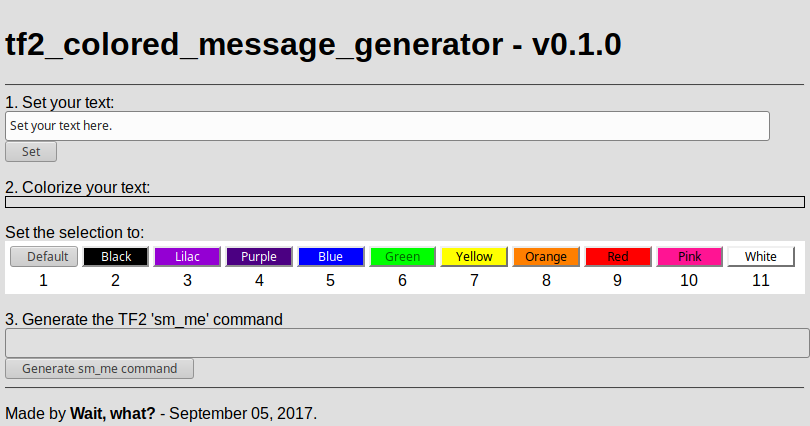

# tf2_colored_message_generator
Easily generate `sm_me` colored messages for Team Fortress 2. Please note that only a few servers allow this. 

It looks like this:

You can acess it [here](https://feikname.github.io/tf2_colored_message_generator/).

If you're interesed, take a look at the [Wiki](https://github.com/feikname/tf2_colored_message_generator/wiki) too.
